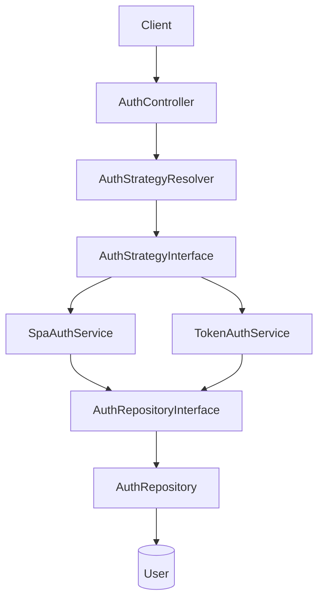
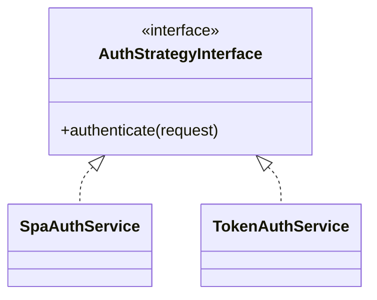
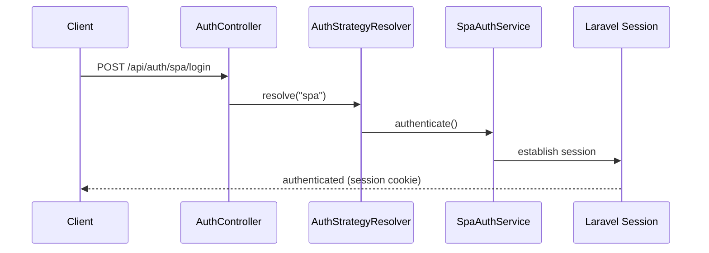
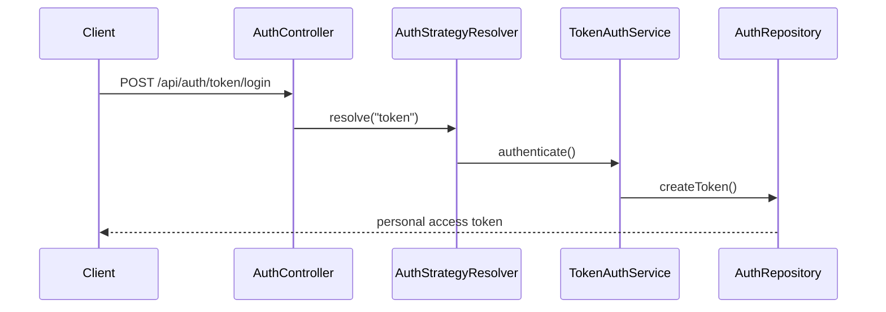

# 🔐 Laravel Auth Strategy

A Laravel backend mini-project built to practice **SOLID principles** and **clean backend architecture** by implementing two authentication strategies — SPA session auth and Sanctum token auth — behind a single, swappable interface.

---

## About

Most small Laravel projects handle authentication with a single `if/else` inside the controller: *"if this is an SPA request, do X, otherwise do Y."* That works until you need to add a third method, test each flow in isolation, or keep the controller readable.

**Laravel Auth Strategy** solves this by treating each authentication method as an interchangeable **strategy**. The controller doesn't know — and doesn't need to know — *how* a user gets authenticated. It only knows *that* an `AuthStrategyInterface` implementation will handle it.

The project supports two authentication approaches, both built on **Laravel Sanctum**:

1. **SPA authentication** — session/cookie-based, for first-party frontends.
2. **Token authentication** — Sanctum personal access tokens, for API/mobile clients.

---

## Features

- 🔀 Two authentication strategies (SPA session-based, Sanctum token-based) behind a shared interface
- 🧩 Strategy Pattern via `AuthStrategyResolver` to select the correct implementation at runtime
- 🗂️ Repository Pattern to isolate persistence logic from authentication business logic
- 💉 Dependency Injection through Laravel's Service Container (interfaces, not concrete classes)
- 🪶 Thin controller — `AuthController` only orchestrates, it never contains auth logic
- 🔑 Sanctum personal access token creation and revocation for token-based clients

---

## Architecture

The dependency flow moves strictly from the controller down through abstractions, never the other way around:



The controller depends on the resolver, the resolver depends on the interface, and the concrete services depend on `AuthRepositoryInterface` rather than `AuthRepository`. Every arrow above points at an abstraction, not an implementation — which is what makes each piece replaceable without touching the others.

---

## Project Structure

```
app/
├── Http/
│   ├── Controllers/
│   │   └── AuthController.php          # Thin HTTP entry point
│   └── Requests/
│       └── UserRequest.php             # Validates incoming credentials
│
├── Repositories/
│   ├── AuthRepository.php              # Concrete persistence implementation
│   └── AuthRepositoryInterface.php     # Persistence contract
│
├── Services/
│   ├── AuthService.php                 # Shared authentication logic
│   ├── AuthStrategyInterface.php       # Contract for auth strategies
│   ├── AuthStrategyResolver.php        # Selects SPA vs Token strategy
│   ├── SpaAuthService.php              # Session-based strategy
│   └── TokenAuthService.php            # Sanctum token strategy
│
└── Providers/
    └── AppServiceProvider.php          # Binds interfaces to implementations
```

| Class | Responsibility |
|---|---|
| `AuthController` | Receives the HTTP request, delegates to the resolver |
| `AuthStrategyResolver` | Chooses `SpaAuthService` or `TokenAuthService` based on the route |
| `AuthStrategyInterface` | Common contract both strategies implement |
| `SpaAuthService` | Authenticates via Laravel session/cookie |
| `TokenAuthService` | Authenticates and issues a Sanctum personal access token |
| `AuthRepositoryInterface` | Persistence contract for auth-related operations |
| `AuthRepository` | Finds users, creates/revokes Sanctum tokens |

---

## Authentication Strategies

### SPA Authentication

Used for first-party, cookie-capable clients (e.g. a Vue/React SPA served from the same domain).

- The user submits credentials to `POST /api/auth/spa/login`.
- `SpaAuthService` authenticates via Laravel's built-in session mechanism.
- Laravel establishes an authenticated session; the browser stores the session cookie.
- Subsequent requests are authenticated automatically via that cookie.
- **No Sanctum personal access token is created for this flow.**

```
Client
  ↓
Login
  ↓
Laravel session
  ↓
Session cookie
  ↓
Authenticated requests
```

### Token Authentication

Used for clients that can't rely on cookies — mobile apps, third-party API consumers, CLI tools.

- The user submits credentials to `POST /api/auth/token/login`.
- `TokenAuthService` verifies the credentials and calls Sanctum's `createToken()` via `AuthRepository`.
- A personal access token is returned to the client.
- The client authenticates subsequent requests with:

```
Authorization: Bearer <token>
```

```
Client
  ↓
Login
  ↓
Sanctum personal access token
  ↓
Bearer token
  ↓
Authenticated API requests
```

Both flows are powered by Sanctum, but they solve different problems: sessions suit a trusted, same-origin frontend; tokens suit stateless, cross-client API access.

---

## Strategy Pattern

Without this pattern, authentication logic tends to collapse into the controller:

```php
if ($type === 'spa') {
    // SPA authentication logic
} elseif ($type === 'token') {
    // Token authentication logic
}
```

This works for two strategies, but grows harder to test and extend with every new method added — and it couples HTTP handling to authentication logic.

Instead, each authentication method is encapsulated in its own service, and both implement `AuthStrategyInterface`:



`AuthStrategyResolver` picks the correct strategy based on the route, and `AuthController` simply delegates to whatever the resolver returns. The controller stays thin, and adding a new strategy never requires modifying the existing ones.

---

## SOLID Principles

### Single Responsibility
Each class does exactly one thing:
- `AuthController` — handles the HTTP request/response cycle
- `AuthStrategyResolver` — selects the appropriate strategy
- `SpaAuthService` / `TokenAuthService` — implement one authentication method each
- `AuthRepository` — handles persistence operations

### Open/Closed
The system is open for extension but closed for modification. A future `OAuthAuthService` could implement `AuthStrategyInterface` and plug into the resolver without changing `SpaAuthService`, `TokenAuthService`, or the controller.

### Liskov Substitution
`SpaAuthService` and `TokenAuthService` both implement `AuthStrategyInterface`, so anywhere the interface is expected, either service can be substituted without breaking the calling code.

### Interface Segregation
`AuthStrategyInterface` and `AuthRepositoryInterface` are each scoped to what their consumers actually need — authentication services aren't forced to depend on unrelated persistence methods, and vice versa.

### Dependency Inversion
High-level services depend on `AuthRepositoryInterface`, not the concrete `AuthRepository`. Laravel's Service Container resolves the actual implementation at runtime, keeping the services decoupled from persistence details.

---

## Authentication Flow

**SPA login:**



**Token login:**



---

## API Endpoints

| Method | Endpoint | Strategy | Description |
|---|---|---|---|
| `POST` | `/api/auth/spa/login` | SPA | Authenticates via Laravel session/cookie |
| `POST` | `/api/auth/token/login` | Token | Authenticates and returns a Sanctum personal access token |

> The authentication type is determined by the route itself, not by a field in the request body — `/spa/login` always triggers `SpaAuthService`, `/token/login` always triggers `TokenAuthService`.

---

## Installation

```bash
git clone https://github.com/InfinityIkh/laravel-auth-strategy.git
cd laravel-auth-strategy

composer install

cp .env.example .env
php artisan key:generate

# Configure your database credentials in .env, then:
php artisan migrate

php artisan serve
```

---

## Configuration

Key environment variables relevant to this project:

| Variable | Purpose |
|---|---|
| `APP_KEY` | Application encryption key, generated via `artisan key:generate` |
| `DB_*` | Database connection settings used by migrations and the repository layer |
| `SANCTUM_STATEFUL_DOMAINS` | Domains treated as "stateful" for SPA/session authentication |
| `SESSION_DOMAIN` | Cookie domain used for SPA session authentication |

---

## Testing

```bash
php artisan test
```

---

## Technologies

- Laravel
- Laravel Sanctum
- PHP

---

## Future Improvements

> These are architectural possibilities, not implemented features.

- 🔗 Additional strategies (e.g. OAuth-based authentication) implementing `AuthStrategyInterface`
- ✅ Expanded automated test coverage for both strategies
- 🚦 Rate limiting on authentication endpoints
- 📣 Authentication-related events (login, logout, token revocation)
- 🛡️ Role/permission-based authorization on top of authentication

---

## Author

**Created by 1f1n1ty_1kh**

GitHub: [https://github.com/InfinityIkh](https://github.com/InfinityIkh)
